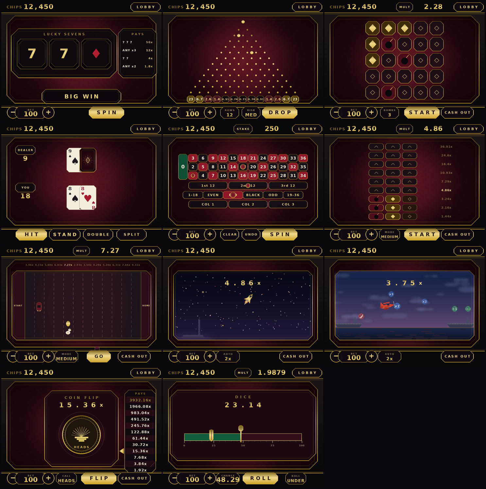

# Club Royale

An art-deco casino for **Scratch 3** — eleven games, generated entirely from
code.



Slots · Plinko · Mines · Blackjack · Roulette · Stairs · Duck Road · Crash ·
Aviamasters · Coin Flip · Dice

Nothing here was made in the Scratch editor. A Python compiler emits
`project.json`, renders every image, synthesises every sound and zips the result
into a `.sb3` you can open with **File → Load from your computer**.

## Play

Download `dist/ClubRoyale.sb3` and load it in the Scratch editor. You start with
1000 chips. There is no rebuy - run out and the session is over until you
hit the green flag again.

## Build

```bash
make deps     # once: pip + npm
make build    # -> dist/ClubRoyale.sb3
make test     # full headless suite (~10 min)
```

Requires Python 3 (pillow, numpy) and Node (scratch-vm).

## House edges

| Game | RTP | |
|---|---|---|
| Slots | 94.3% | 3 reels, up to 50x |
| Plinko | 95.3% | 8/12/16 rows x low/med/high risk, up to 400x |
| Mines | 96% | 1/3/5/10 bombs |
| Blackjack | — | double, split, insurance, 3:2 naturals, dealer stands on 17 |
| Roulette | 97.30% | European single zero, stack chips on any spots |
| Stairs | 96% | 9 rows, 5 modes, up to 251,658x on Master |
| Duck Road | 96% | 12 lanes, 4 modes, hidden 3x golden egg, up to 27,845x |
| Crash | 96% | rocket climb, up to 9,600x, auto cash-out at 1.5x/2x/5x/10x |
| Aviamasters | 96% | 14 orbs on the route, rockets halve, up to 250x |
| Coin Flip | 96% | call a side, 12 rungs of 0.96 x 2^n, up to 3,932x |
| Dice | 96% | drag the threshold anywhere on 0.00-99.99, under or over, 1.01x to 96x |

Every multiplier is solved to a target house edge by `src/tables.py` through
`src/tables6.py`, and verified per-round by the test suite rather than
statistically. Coin Flip's ladder is exact - `0.96 x 2^n` terminates at two
decimals, so the 0.96 holds to the last bit on every rung. Dice has a dragged
threshold and so computes its multiplier where the slider is left; it floors
rather than rounds, which means the return is never *above* 0.96, and the
suite checks all 9401 reachable positions stay within 0.0001 of it.

## Verification

The suite loads the real `scratch-vm` and plays the game headlessly, checking
each payout against an independently written implementation of the rules:

```bash
node tests/play_blackjack.js dist/ClubRoyale.sb3 110
node tests/play_games.js     dist/ClubRoyale.sb3 50
node tests/play_core.js      dist/ClubRoyale.sb3 40 6 8
node tests/play_duck.js      dist/ClubRoyale.sb3 40
node tests/play_crash.js     dist/ClubRoyale.sb3 20
node tests/play_avia.js      dist/ClubRoyale.sb3 30
node tests/play_coin.js      dist/ClubRoyale.sb3 24
node tests/play_dice.js      dist/ClubRoyale.sb3 40
node tests/overlap.js        dist/ClubRoyale.sb3
node tests/boot_race.js      dist/ClubRoyale.sb3
```

`overlap.js` is the one that catches a button hidden behind another sprite —
something the logic tests cannot see, because they fire click handlers directly.

## Limitations

- **No saving.** Scratch only persists via cloud variables, which need the
  project shared on scratch.mit.edu with a full Scratcher account.
- Bankrolls over a million are abbreviated (`12.58M`, `1.26B`) - the top bar
  has room for seven characters.

## For contributors

`CLAUDE.md` is the entry point. Read `docs/PITFALLS.md` before touching block
logic — it documents the Scratch execution behaviour that has caused real bugs
here, including two that shipped.

## License

MIT — see [LICENSE](LICENSE).
